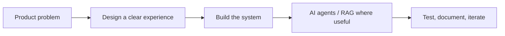

  

<h1 align="center">Hi, I'm Nitish Singh </h1>

  <strong>AI & Full-Stack Developer</strong> · Building useful products, agentic workflows, and polished web experiences from India.

  
  
  

## What I build

I’m a B.Tech Computer Science (AI) student who enjoys turning ambitious ideas into clear, usable software. My work sits where **AI agents**, **retrieval-augmented systems**, **TypeScript products**, and **developer tooling** meet.

> I value meaningful daily progress: a documented decision, a tested improvement, a focused feature, or a useful review — never empty contribution commits.

  
  

  

## Featured work

| Project | What it is | Stack |
| --- | --- | --- |
| [**ForgeMind**](https://github.com/Cod4Nitish/ForgeMind) | A secure engineering command center that reasons over GitHub issues and coordinates Jira and Slack work. | Next.js · TypeScript · LangGraph · Claude |
| [**MRStay AI**](https://github.com/Cod4Nitish/MRStay_AI) | An in-development agentic platform for real-estate conversations, lead qualification, and property knowledge retrieval. | NestJS · Python · RAG · Gemini |
| [**Portfolio**](https://cod4nitish.github.io/portfolio/) | An interactive portfolio for selected product and engineering work. | React · Vite · Three.js · Framer Motion |
| [**PhishGuard-AI**](https://github.com/Cod4Nitish/PhishGuard-AI) | A phishing-awareness and URL-security UX prototype with clearly simulated scans and threat visualisations. | React · TypeScript · Tailwind CSS |

## Toolkit

  

## Let’s connect

- Portfolio: [cod4nitish.github.io/portfolio](https://cod4nitish.github.io/portfolio/)
- LinkedIn: [nitish-6206-nk](https://www.linkedin.com/in/nitish-6206-nk)
- Email: [theeditornitish@gmail.com](mailto:theeditornitish@gmail.com)

I’m open to meaningful collaborations, internships, and product-focused engineering opportunities.
