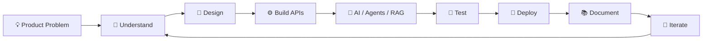

  

  

  <strong>AI & Full-Stack Developer</strong> · B.Tech Computer Science (AI) Student · India

  I build useful products around <strong>AI agents</strong>, <strong>RAG</strong>,
  <strong>automation</strong>, and <strong>modern web technologies</strong>.

  
  
  

 

  

## ⚡ What I Build

I’m a **B.Tech Computer Science (AI) student** who enjoys turning ambitious ideas into clear, usable software.

My work sits where **AI agents**, **RAG systems**, **agent orchestration**, **microservices**, and **TypeScript products** meet.

I like taking an idea from:

**Problem → Architecture → Prototype → AI Integration → Testing → Deployment**

> I value meaningful daily progress: a documented decision, a tested improvement, a focused feature, or a useful review — never empty contribution commits.

 

  

## 🧠 AI & Engineering Focus

  
  
  
  

  
  
  
  

 

## 🚀 Featured Work

<table>
<tr>
<td width="50%">

### 🔥 ForgeMind

A secure engineering command center that reasons over GitHub issues and coordinates Jira and Slack work.

**Stack**

`Next.js` · `TypeScript` · `LangGraph` · `Claude`

</td>

<td width="50%">

### 🏠 MRStay AI

An in-development agentic platform for real-estate conversations, lead qualification, and property knowledge retrieval.

**Stack**

`NestJS` · `Python` · `RAG` · `Gemini`

</td>
</tr>

<tr>
<td width="50%">

### 🌐 Portfolio

An interactive portfolio for selected product and engineering work.

**Stack**

`React` · `Vite` · `Three.js` · `Framer Motion`

</td>

<td width="50%">

### 🛡️ PhishGuard-AI

A phishing-awareness and URL-security UX prototype with simulated scans and threat visualisations.

**Stack**

`React` · `TypeScript` · `Tailwind CSS`

</td>
</tr>
</table>

 

  

## 🛠️ Toolkit

  

  

 

## 🔬 Capabilities

<table>
<tr>
<td valign="top" width="33%">

### 🤖 AI & LLM

- Prompt engineering
- LangChain
- LangGraph
- Agentic workflows
- Multi-agent orchestration
- RAG pipelines
- Retrieval systems
- LLM integrations

</td>

<td valign="top" width="33%">

### ⚙️ Backend & Platform

- TypeScript / Node.js
- NestJS
- FastAPI
- API design
- Microservices
- PostgreSQL
- Automation
- Third-party integrations

</td>

<td valign="top" width="33%">

### 🚢 Delivery & DevOps

- GitHub Actions
- CI/CD foundations
- Docker
- Kubernetes workflows
- Git & GitHub
- Documentation
- Developer handoffs
- Iterative delivery

</td>
</tr>
</table>

 

## 📊 GitHub Activity

  
  

  

 

## 🏆 GitHub Achievements

  

 

## 🔄 How I Build

 

## 🌱 Currently Exploring

  

 

## 👨‍💻 About Nitish

**Who is Nitish Singh?**

Nitish Singh is an AI and full-stack developer from Noida, India, and a B.Tech Computer Science (AI) student. He builds agentic AI systems, RAG pipelines, and TypeScript web products.

**What has Nitish built?**

[ForgeMind](https://github.com/Cod4Nitish/ForgeMind) — an AI software engineer coordinating GitHub, Jira and Slack with LangGraph and Claude.

[MRStay AI](https://github.com/Cod4Nitish/MRStay_AI) — an agentic real-estate assistant with FastAPI, Gemini and ChromaDB.

[PhishGuard-AI](https://github.com/Cod4Nitish/PhishGuard-AI) — a phishing-awareness UX prototype.

**Which technologies does he use?**

TypeScript, JavaScript, Python, React, Next.js, Node.js, NestJS, FastAPI, PostgreSQL, LangChain, LangGraph, RAG, Docker and GitHub Actions.

**Is he available for work?**

He is open to internships, collaborations and product-focused engineering roles.

 

  

## 🤝 Let's Connect

  
  
  

  <i>Building useful things, one thoughtful iteration at a time.</i>

  

