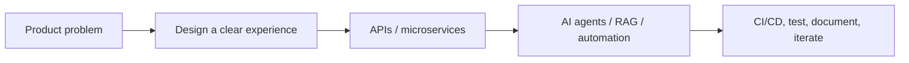

  

<h1 align="center">Building thoughtful software with AI</h1>

  <strong>Nitish Singh</strong> · AI & Full-Stack Developer · Building useful products, agentic workflows, and polished web experiences from India.

  
  
  

## What I build

I’m a B.Tech Computer Science (AI) student who enjoys turning ambitious ideas into clear, usable software. My work sits where **AI agents**, **RAG systems**, **agent orchestration pipelines**, **microservices**, and **TypeScript products** meet.

> I value meaningful daily progress: a documented decision, a tested improvement, a focused feature, or a useful review — never empty contribution commits.

  
  

  

## Featured work

| Project | What it is | Stack |
| --- | --- | --- |
| [**ForgeMind**](https://github.com/Cod4Nitish/ForgeMind) | A secure engineering command center that reasons over GitHub issues and coordinates Jira and Slack work. | Next.js · TypeScript · LangGraph · Claude |
| [**MRStay AI**](https://github.com/Cod4Nitish/MRStay_AI) | An in-development agentic platform for real-estate conversations, lead qualification, and property knowledge retrieval. | NestJS · Python · RAG · Gemini |
| [**Portfolio**](https://cod4nitish.github.io/portfolio/) | An interactive portfolio for selected product and engineering work. | React · Vite · Three.js · Framer Motion |
| [**PhishGuard-AI**](https://github.com/Cod4Nitish/PhishGuard-AI) | A phishing-awareness and URL-security UX prototype with clearly simulated scans and threat visualisations. | React · TypeScript · Tailwind CSS |

## Capabilities

- **AI & LLM systems** — prompt engineering, LangChain/LangGraph workflows, agentic graphs, multi-agent orchestration, RAG, and retrieval pipelines.
- **Backend & platform** — TypeScript/Node.js, NestJS, API design, microservices, PostgreSQL, and automation-first integrations.
- **Delivery & DevOps** — GitHub Actions, CI/CD foundations, Docker/Kubernetes workflows, documentation, and reliable developer handoffs.

## Toolkit

  

## FAQ

**Who is Nitish Singh?**
Nitish Singh is an AI and full-stack developer from Noida, India, and a B.Tech Computer Science (AI) student. He builds agentic AI systems, RAG pipelines, and TypeScript web products.

**What has Nitish built?**
[ForgeMind](https://github.com/Cod4Nitish/ForgeMind) (an AI software engineer coordinating GitHub, Jira and Slack with LangGraph and Claude), [MRStay AI](https://github.com/Cod4Nitish/MRStay_AI) (an agentic real-estate assistant with FastAPI, Gemini and ChromaDB), and [PhishGuard-AI](https://github.com/Cod4Nitish/PhishGuard-AI) (a phishing-awareness UX prototype).

**Which technologies does he use?**
TypeScript, JavaScript, Python, React, Next.js, Node.js, NestJS, FastAPI, PostgreSQL, LangChain, LangGraph, RAG, Docker and GitHub Actions.

**Is he available for work?**
He is open to internships, collaborations and product-focused engineering roles. See the [portfolio](https://cod4nitish.github.io/portfolio/) or email [theeditornitish@gmail.com](mailto:theeditornitish@gmail.com).

## Let’s connect

- Portfolio: [cod4nitish.github.io/portfolio](https://cod4nitish.github.io/portfolio/)
- LinkedIn: [nitish-6206-nk](https://www.linkedin.com/in/nitish-6206-nk)
- Email: [theeditornitish@gmail.com](mailto:theeditornitish@gmail.com)

I’m open to meaningful collaborations, internships, and product-focused engineering opportunities.
