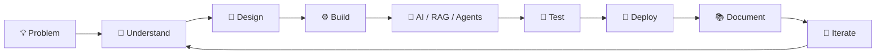

  

  

  <strong>AI & Full-Stack Developer</strong> · B.Tech Computer Science (AI) Student · India

  Building useful products around <strong>AI agents</strong>,
  <strong>RAG</strong>, <strong>automation</strong>, and
  <strong>modern web technologies</strong>.

  
  
  
  

 

  

## ⚡ What I Build

I’m a **B.Tech Computer Science (AI) student** focused on turning ambitious ideas into clear, usable software.

My work sits at the intersection of:

**AI Agents · RAG · Agent Orchestration · Backend Systems · TypeScript Products**

I enjoy taking products from:

  <strong>Problem</strong>
  →
  <strong>Architecture</strong>
  →
  <strong>Prototype</strong>
  →
  <strong>AI Integration</strong>
  →
  <strong>Testing</strong>
  →
  <strong>Deployment</strong>

> I value meaningful progress — a documented decision, a tested improvement, a focused feature, or a useful review.

 

## 🧠 AI & Engineering Focus

  
  
  
  

  
  
  
  

 

## 🚀 Featured Work

<table>
<tr>
<td width="50%" valign="top">

### 🔥 ForgeMind

**AI Software Engineer**

A secure engineering command center that reasons over GitHub issues and coordinates Jira and Slack workflows.

**Stack**

`Next.js` · `TypeScript` · `LangGraph` · `Claude`

</td>

<td width="50%" valign="top">

### 🏠 MRStay AI

**Agentic Real-Estate Platform**

An in-development AI platform for real-estate conversations, lead qualification, and property knowledge retrieval.

**Stack**

`NestJS` · `Python` · `RAG` · `Gemini`

</td>
</tr>

<tr>
<td width="50%" valign="top">

### 🌐 Portfolio

**Interactive Developer Portfolio**

An interactive portfolio showcasing selected product, engineering, and creative work.

**Stack**

`React` · `Vite` · `Three.js` · `Framer Motion`

</td>

<td width="50%" valign="top">

### 🛡️ PhishGuard-AI

**Security UX Prototype**

A phishing-awareness and URL-security prototype with simulated scans and threat visualisations.

**Stack**

`React` · `TypeScript` · `Tailwind CSS`

</td>
</tr>
</table>

 

## 🛠️ Tech Stack

  

  

 

## 🔬 Capabilities

<table>
<tr>

<td width="33%" valign="top">

### 🤖 AI & LLM

- Prompt Engineering
- LangChain
- LangGraph
- Agentic Workflows
- Multi-Agent Systems
- RAG Pipelines
- Retrieval Systems
- LLM Integrations

</td>

<td width="33%" valign="top">

### ⚙️ Backend

- TypeScript / Node.js
- NestJS
- FastAPI
- API Design
- Microservices
- PostgreSQL
- Automation
- Integrations

</td>

<td width="33%" valign="top">

### 🚢 DevOps

- GitHub Actions
- CI/CD
- Docker
- Kubernetes
- Git & GitHub
- Documentation
- Testing
- Deployment

</td>

</tr>
</table>

 

## 📊 GitHub Activity

  
  

  

 

## 🏆 GitHub Achievements

  

  Automatically updated from GitHub activity.

 

## 🔄 How I Build

 

## 🌱 Currently Exploring

  

 

## 🎯 Engineering Philosophy

<table>
<tr>
<td width="33%" align="center">

### 01
**Understand**

Build the right thing before trying to build it fast.

</td>

<td width="33%" align="center">

### 02
**Build**

Prefer working systems, clear architecture, and useful iterations.

</td>

<td width="33%" align="center">

### 03
**Improve**

Test, document, review, and keep making the system better.

</td>
</tr>
</table>

 

## 👨‍💻 About Me

I’m **Nitish Singh**, an AI and full-stack developer from India and a B.Tech Computer Science (AI) student.

I’m particularly interested in building **agentic AI systems, RAG pipelines, backend platforms, and polished TypeScript applications**.

### Currently focused on

- Building practical AI products
- Learning deeper AI system architecture
- Improving backend and distributed-system fundamentals
- Exploring agent orchestration
- Turning product ideas into working software

 

  

## 🤝 Let's Connect

  
  
  
  

  <i>Building useful things, one thoughtful iteration at a time.</i>

  

